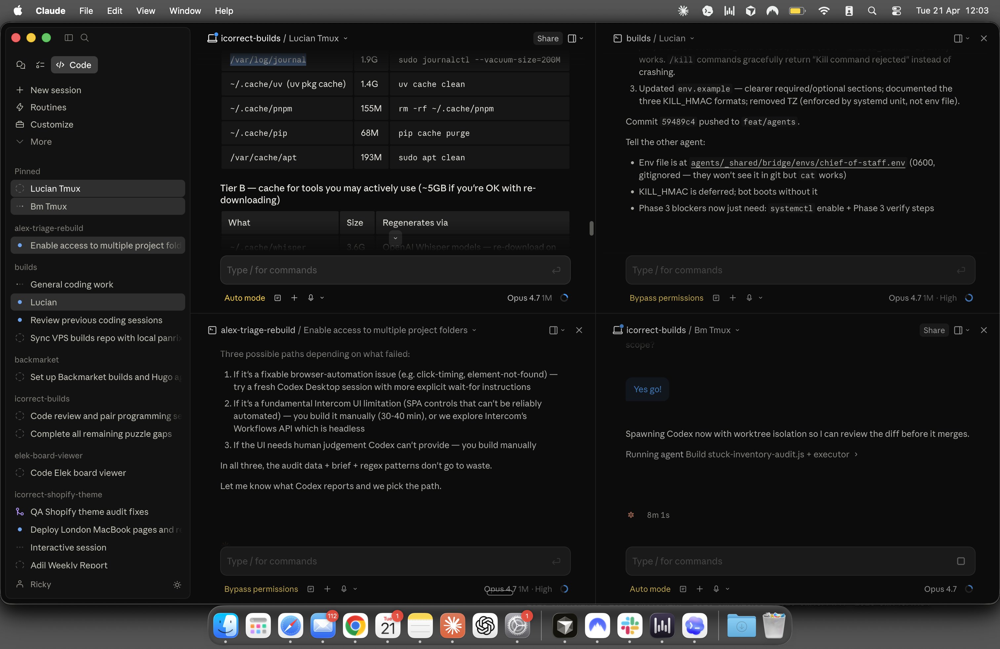
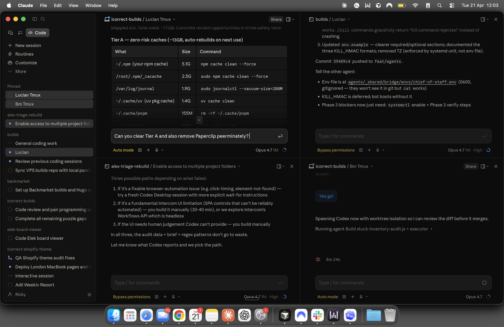
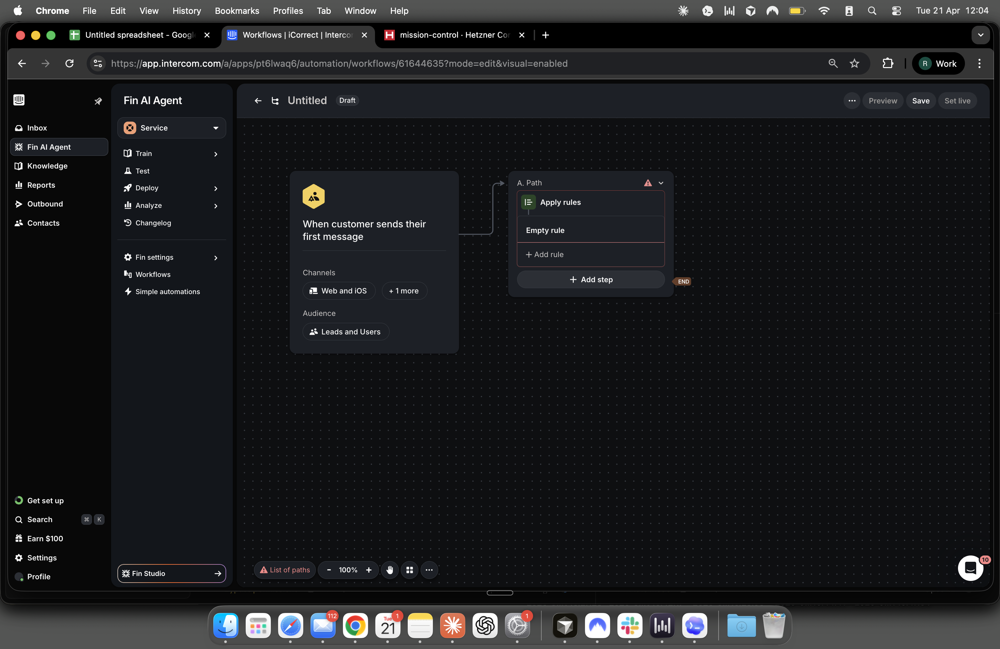
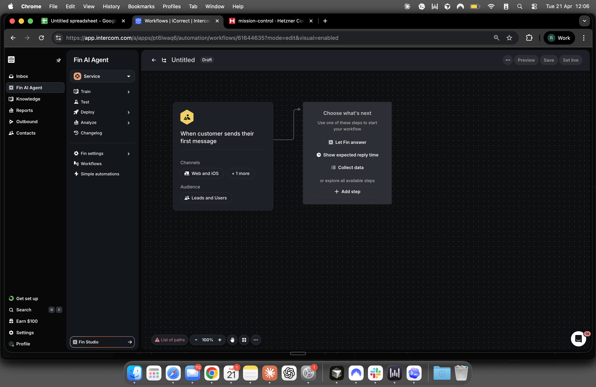
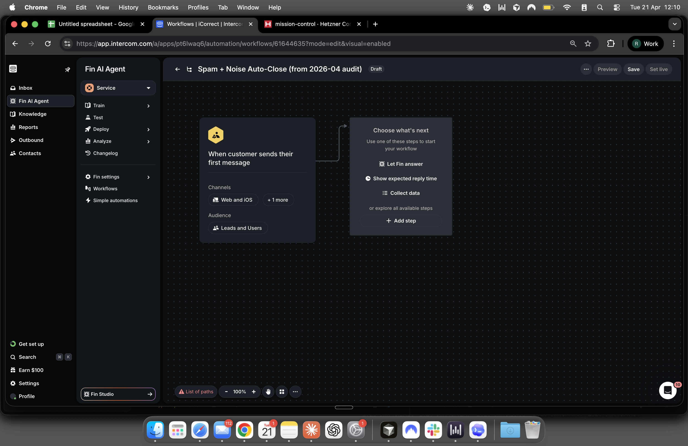

# Workflow Build Blocker Report

Date: 2026-04-21

Workspace: `pt6lwaq6`

Workflow draft: `Spam + Noise Auto-Close (from 2026-04 audit)`

Workflow URL: `https://app.intercom.com/a/apps/pt6lwaq6/automation/workflows/61644635?mode=edit&visual=enabled`

## Final Status

I stopped the build rather than leaving a half-complete safety rule in place.

The workflow remains in `Draft`.

No partial `Branches` or `Apply rules` blocks are left in the graph.

The reusable setup that was kept:

- Draft workflow shell exists with the correct title.
- Trigger remains `When customer sends their first message`.
- The graph is back to an empty shell state, ready for a later rebuild.

What was intentionally not kept:

- No incomplete rule groups.
- No half-built protected-topic whitelist.
- No half-built automated or spam groups.
- No `Live` promotion.

Items not created during this session:

- Tag `automated`
- Tag `spam`
- Tag `auto-closed`

## Cleanup Performed

I deleted the incomplete rule-building blocks that had been inserted during exploration because they could not be completed reliably enough for a safety-critical auto-close workflow.

Removed from the draft:

- Temporary `Branches` step used to test protected-topic matching behavior.
- Temporary `Apply rules` step used to test whether grouped precedence could be built safely.

Kept in the draft:

- Workflow title
- Draft state
- First-message trigger

## What I Was Able To Build

Built safely:

- Workflow shell
- Correct trigger
- Clean draft state with no active rule groups

Proved temporarily during exploration, then removed:

- A `Branches` step with a single test condition on message content
- An `Apply rules` step with one empty starter row

Not built successfully:

- Protected-topic precedence group
- Automated-match group
- Spam-match group
- Final auto-close path
- Full stop behavior needed to guarantee legitimate customers are never auto-closed

## Specific UI Controls That Failed

These were the concrete controls that prevented a reliable, complete build in the Intercom UI.

### 1. `Branches` condition builder was too brittle for safe protected-topic logic

Observed controls:

- Branch step node: `.workflows__graph-editor__node-items__steps__branches`
- Condition attribute picker area: `.js__ghostinspector__attribute-picker`
- Add-condition affordance: `.filter-group__add-button`
- Picker search field labeled `Search data...`

Observed failures:

- The attribute picker did not open consistently from the obvious clickable area; in practice it often responded only through the tiny add/plus affordance.
- Focus inside the picker and value field drifted unpredictably, so the intended attribute/operator/value combination was not always the one that persisted.
- Value entry was only intermittently durable; simple scripted fill behavior was not enough, and even delayed synthetic typing was fragile.
- Most importantly, additional conditions inside the tested branch builder combined as `and`, not `or`, which is the opposite of the safe shape needed for a broad protected-topic whitelist.

Why this matters:

The protected-topic rule needs deterministic precedence and broad positive coverage. A brittle editor plus `and`-style combination inside the wrong primitive creates a real risk of under-matching legitimate topics and auto-closing them later in the flow.

### 2. `Apply rules` opened, but its rule controls were not reliable enough to finish

Observed controls:

- Apply-rules step node: `.workflows__graph-editor__node-items__steps__apply-rules`
- Drawer region where clicking the `.my-5` parent created the first empty rule row
- Rule-level controls labeled `Add rule`, `Add condition`, and `Add action`

Observed failures:

- I could open the `Apply rules` drawer and create the initial empty rule row.
- After that, the rule-condition and rule-action controls were not responding reliably enough to build the exact precedence tree from the brief.
- This meant I could not safely encode: protected topics first, then deterministic automated, then deterministic spam, then close-tag-stop behavior, with confidence that the saved draft matched the intended logic.

Why this matters:

This workflow is safety-critical. An apparently saved but structurally wrong rule order would be worse than leaving the draft empty.

### 3. Hidden step menus made precise edit/delete recovery fragile

Observed controls:

- Hover menu wrapper: `.workflows__graph-editor__hover-step-menu-wrapper`
- Overflow dropdown item: `.ds-new__dropdown__block__item[data-dropdown-item="Delete"]`

Observed failures:

- Menus were only available through hover-state wrappers and were easy to miss or target incorrectly.
- Recovery was still possible, but only after DOM-level inspection and targeted interaction.

Why this matters:

Once the rule editor became untrustworthy, cleanup itself depended on brittle hidden controls. That is another reason I removed all partial blocks instead of leaving them behind for someone else to accidentally activate later.

## Screenshots

Failure and recovery screenshots saved in `verification-screenshots/`:

- [01-partial-workflow-before-cleanup.png](verification-screenshots/01-partial-workflow-before-cleanup.png)
- [02-apply-rules-drawer-empty-rule.png](verification-screenshots/02-apply-rules-drawer-empty-rule.png)
- [03-branches-drawer-condition-editor.png](verification-screenshots/03-branches-drawer-condition-editor.png)
- [04-clean-shell-after-cleanup.png](verification-screenshots/04-clean-shell-after-cleanup.png)
- [05-clean-shell-with-title.png](verification-screenshots/05-clean-shell-with-title.png)

Inline references:

## Suggested Alternatives

### 1. Use API-backed tagging and closing outside the workflow UI

This is the safest alternative if the UI builder remains brittle.

Official Intercom docs currently show:

- `POST /tags` can create or update a tag by name.
- `POST /conversations/{conversation_id}/tags` can apply a tag to a conversation.
- `POST /conversations/{convo_id}/reply/` with `message_type: close` can close a conversation.

That means a safer architecture is possible:

- Run deterministic classification outside the Intercom builder.
- Apply `automated`, `spam`, or `auto-closed` tags by API.
- Only close the conversation by API after the protected-topic checks have already passed in code.

Official docs:

- [Create or update a tag](https://developers.intercom.com/docs/references/rest-api/api.intercom.io/tags/createtag)
- [Add tag to a conversation](https://developers.intercom.com/docs/references/2.9/rest-api/api.intercom.io/tags/attachtagtoconversation)
- [Closing or reopening a conversation](https://developers.intercom.com/docs/references/1.0/rest-api/conversations/closing-a-conversation)

### 2. Treat the workflow UI as shell-only, and verify exports before any go-live

Intercom's official Workflows API docs currently expose workflow export, not a public create/update workflow endpoint. This is an inference from the published Workflows section as checked on 2026-04-21.

That still makes the export endpoint useful as a verification step:

- Build or edit a draft cautiously.
- Export the workflow configuration.
- Review the exported `steps`, targeting, and embedded rules before anyone sets it live.

Official docs:

- [Workflows API overview](https://developers.intercom.com/docs/references/rest-api/api.intercom.io/workflows)
- [Export a workflow](https://developers.intercom.com/docs/references/preview/rest-api/api.intercom.io/workflows/exportworkflow)

### 3. Simplify the UI design so protected topics never share a complex precedence tree

If this must stay UI-only, reduce the number of things the workflow builder has to do correctly.

Safer simplifications:

- Use one workflow only for high-confidence `automated` tagging.
- Use a separate workflow or human-review queue for `spam` instead of immediate auto-close.
- Keep protected topics entirely out of auto-close logic and route them to manual review by default.
- Only add close behavior after a smaller draft has been manually verified in Intercom preview and, if possible, against exported workflow JSON.

## Notes

- Nothing was flipped to `Live`.
- The final draft visible at the time of verification was titled correctly and showed no remaining rule-group blocks.
- I was not able to materialize the Linux-style `/home/ricky/...` alias in this macOS environment because `/home` resolves to a read-only system-managed location here, so this report is stored in the workspace at the path shown above.
