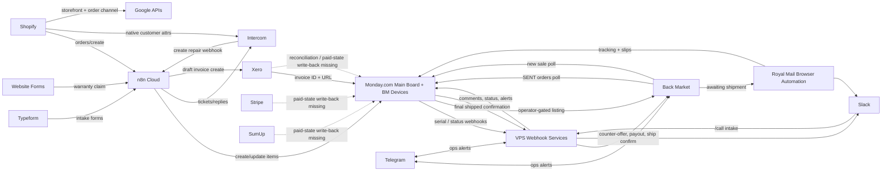

# iCorrect Systems Architecture

Date: 2026-04-02
Scope: synthesis only from the requested summary documents and confirmed operator answers.

## 1. Systems of Record

| Domain | Canonical system | Why this is the source of truth | Notes |
|---|---|---|---|
| Customer identity | Monday.com | Confirmed by operator on 2026-04-02: Monday is the canonical customer identity source and links out to other systems. | Intercom, Shopify, and Xero are downstream/enrichment systems. |
| Repair tracking | Monday.com | Main board `349212843` is the operational backbone for intake, diagnostics, repair, QC, shipping, BM trade-in, and resale state. | High risk: the board is structurally overloaded and carries large stale queue debt. |
| Comms | Intercom | Customer-facing replies, warranty claims, quote-era comms since 2026, and status notifications terminate in Intercom. | Monday still stores operational context; Intercom is the customer conversation layer. |
| Finance | Xero | Live accounting ledger for invoices, payments, bank transactions, receivables, payables, and reporting under cash accounting. | Monday payment fields are not reliable enough to be treated as finance truth. |
| Inventory | Monday.com | BM Devices board `3892194968` and Parts/Stock Levels board `985177480` hold live device/parts operational inventory. | Supplier cost truth is weak; Xero purchase invoices are the fallback evidence source. |
| Shipping | Monday.com | Monday is the final human-confirmed release gate: dispatch writes tracking to Monday, and BM shipping confirmation fires only after Monday status changes to `Shipped`. | Royal Mail executes labels; Back Market is the external channel; Monday is the operational shipping truth. |
| Marketing | Google APIs | The clearest measurement/attribution surface is Google Analytics and Search Console. | Access is split and degraded because refresh-token ownership is not clean. Shopify remains the ecommerce channel. |
| Team | Monday.com | Confirmed by operator on 2026-04-02: technician groups on the main board represent repair queues and physical workstations, and there is no other bench-allocation system. | Slack is the team comms layer, not the allocation source of truth. |

## 2. Data Flow Map

| Source -> target | What flows | How | Direction | Owner | Health |
|---|---|---|---|---|---|
| Shopify -> n8n Cloud -> Monday.com / Intercom / Slack | New ecommerce orders, customer details, service type, address, IMEI/SN, payment/source metadata | Shopify `orders/create` trigger into active n8n workflow | One-way ingress | ecommerce / ops | Live healthy |
| Shopify -> Intercom | Customer/order attributes on Intercom contacts | Native Shopify integration | One-way sync | customer service / ecommerce | Live degraded |
| Typeform -> n8n Cloud -> Monday.com / Intercom / Slack | Walk-in intake, pre-repair answers, collection/drop-off routing, validation state | Typeform triggers into active n8n workflows | One-way ingress | intake / customer service / ops | Live degraded |
| Intercom -> n8n Cloud -> Monday.com | Repair creation from Intercom context | Webhook-driven n8n workflow | One-way ingress | customer service / ops | Live healthy |
| Website -> n8n Cloud -> Intercom | Warranty claim identity, device, issue, support conversation linkage | `warranty-claim` webhook + Intercom create/search/swap flow | One-way ingress | customer service / aftercare | Live healthy |
| Slack `/call` -> telephone-inbound -> Intercom / Monday.com / Slack | Phone enquiry details, optional lead/ticket/item creation | Slack command + VPS service | One-way ingress with operator choice | front desk / customer service | Live healthy |
| Monday.com -> VPS `icloud-checker` -> Monday.com / Back Market / Slack | Serial, iCloud/spec checks, lock/suspension actions, spec mismatch escalation | Monday webhook on serial column `text4` | One-way trigger with write-back | BM intake | Live healthy |
| Monday.com -> VPS `bm-grade-check` -> Slack / Monday.com | Grade/cost fields, linked BM device context, profitability warnings | Monday webhook on `status4 = Diagnostic Complete` | One-way trigger with advisory write-back | BM refurb / pricing ops | Live healthy |
| Monday.com -> VPS `bm-payout` -> Back Market | Trade-in payout validation and execution | Monday webhook on `status24 = Pay-Out` | One-way trigger with write-back | BM trade-in ops | Live healthy |
| Monday.com -> VPS `bm-shipping` -> Back Market | Tracking, serial, linked BM item, BM order state update | Monday webhook on `status4 = Shipped` | One-way trigger with write-back | BM sales / dispatch | Live healthy |
| Monday.com -> `list-device.js` -> Back Market / Monday.com | Listing draft, publish, product UUID, SKU, fixed cost, list status | Operator-run script from `To List` state | One-way trigger with write-back | BM resale ops | Live degraded |
| Back Market -> `sent-orders.js` -> Monday.com / BM Devices / Telegram | New SENT trade-in orders, customer/spec/order summary, linked item creation | Scheduled polling script | One-way ingress | BM trade-in ops | Live healthy |
| Back Market -> `sale-detection.js` -> Monday.com / BM Devices / Telegram | New resale order, buyer/order details, sold state | Scheduled polling + BM order acceptance | One-way ingress | BM resale ops | Live healthy |
| Back Market -> `dispatch.js` -> Royal Mail / Slack / Monday.com | Label purchase, tracking, packaging slips, dispatch summary | Scheduled browser automation | One-way operational push | BM sales / dispatch | Live degraded |
| Monday.com -> n8n Cloud -> Xero -> Monday.com | Invoice request, customer/contact resolution, draft invoice ID/URL write-back | Monday webhook `Invoice Action -> Create Invoice` into active n8n workflow | One-way trigger with write-back | finance | Live degraded |
| Stripe / SumUp / Xero -> Monday.com | Paid status and reconciliation state | Intended write-back path only; no working live owner | Missing/broken | finance / operations | Broken |
| Monday.com -> Intercom status notifications | Customer status replies for repair milestones | VPS replacement is live as of 2026-04-01, but cleanup of legacy webhook estate is incomplete | One-way notification | customer service | Live degraded |

## 3. Automation Inventory

### Live healthy

- Shopify Order to Monday.com + Intercom + Slack
- Intercom -> Monday (Create Repair)
- Warranty Claim Form -> Intercom
- Slack `/call` -> telephone-inbound -> Intercom / Monday
- Monday serial entry -> `icloud-checker`
- Monday `Diagnostic Complete` -> `bm-grade-check`
- Monday `Pay-Out` -> `bm-payout`
- Monday `Shipped` -> `bm-shipping`
- Back Market SENT order polling -> Monday / BM Devices
- Back Market new sale polling -> Monday / BM Devices

### Live degraded

- Typeform intake flows are active, but canonical env credentials are stale for Typeform.
- Shopify native -> Intercom contact sync is active/partially verified, but ownership and overlap with n8n-driven sync are not cleanly defined.
- Monday -> Xero invoice creation is live, but it stops at draft creation, embeds secret material, and does not close the sent/paid loop.
- Monday `To List` -> `list-device.js` is live but operator-gated rather than scheduler-owned.
- Royal Mail dispatch is live through browser automation, not a working API integration.
- Monday -> Intercom status notifications are live on the VPS path as of 2026-04-01, but legacy Cloudflare/webhook cleanup is incomplete.

### Live unknown

- Monday catch-all webhook `537444955` (`Stock Checker`) is active and firing on every column change, but its destination URL is still unknown without Monday UI inspection.
- Monday catch-all webhook `530471762` (`Notifications.`) is active and firing on every column change, but its destination URL is still unknown without Monday UI inspection.
- Legacy catch-all webhooks `349863361`, `349863952`, and `350113039` also have empty configs and unclear downstream ownership.

### Dormant

- Older BM n8n workflows are present but inactive: sent trade-in flows, BM iCloud flows, payout approval, BM listing, and ship confirmation.
- Self-hosted n8n is reachable but appears to be a low-activity runtime rather than a primary live automation owner.

### Missing

- Payment-received write-back from Stripe, SumUp, and Xero into Monday.
- A working reconciliation loop across Monday, Stripe, SumUp, and Xero.
- Corporate invoice paid-state write-back into Monday.
- A proven live `Send Invoice` automation from Monday into Xero beyond draft creation.

## 4. Integration Gaps

| Gap | Confirmed state | Impact |
|---|---|---|
| Stripe / SumUp / Xero -> Monday paid-state write-back | Broken as of operator confirmation on 2026-04-02; no owner exists. | The business is blind on payment status outside clean Shopify reconciliation. |
| Reconciliation across Monday, Stripe, SumUp, and Xero | Broken and ownerless. Archived logic should be explicitly retired, not restored. | Operations and finance cannot trust paid/unpaid status or channel-level cash closure. |
| Corporate invoice paid -> Monday | Broken; no write-back exists when invoices are paid. | Repair items can remain operationally unpaid even when money has been received. |
| Monday -> Xero send/paid loop | Only `Create Invoice` is evidenced live; no separate live `Send Invoice` trigger was found. | Finance automation stops at draft creation and leaves downstream closure manual. |
| Monday catch-all webhooks -> unknown consumers | Active, destination unknown, and burning thousands of automation actions per day. | Cleanup can break hidden dependencies; current spend and risk are both high. |
| Canonical env -> Typeform | Broken in `config/.env`; working token lives elsewhere. | Agents/services can misclassify Typeform as dead and fail form-linked processes. |
| Canonical env -> SumUp | Broken in `config/.env`; working key lives elsewhere. | Live in-store payment rail can be misclassified as unavailable. |
| Google token ownership | Split across tokens and env files; Edge token missing from one env. | Marketing/Drive/Search Console reach depends on which credential source is loaded. |
| Royal Mail API | Parked/broken; current runtime is browser automation only. | Shipping still works, but not through a maintainable API-owned integration. |

## 5. Credential and Access Map

| System | Status | Notes |
|---|---|---|
| Monday.com | Working | Live GraphQL access; main operational backbone. |
| Back Market | Working | Live API access with required header set; core BM ops depend on it. |
| Intercom | Working | Live workspace and large active contact/conversation inventory. |
| Shopify | Over-scoped | Token documented as read-only, but live scopes include multiple write permissions. |
| n8n Cloud | Working | Primary live automation runtime with 13 active workflows. |
| n8n Self-Hosted | Working | Reachable, but likely low-activity/dormant. |
| Xero | Working | Live via `config/api-keys/.env`; risk is secret sprawl inside the active invoice workflow. |
| Stripe | Working | Live API access and payment-intent evidence. |
| SumUp | Broken canonical / working alternate | `config/.env` key fails; `config/api-keys/.env` key works. |
| Typeform | Broken canonical / working alternate | `config/.env` token fails; `config/api-keys/.env` token works. |
| Google APIs | Broken canonical / split | Access is partial and token ownership is split across env files/tokens. |
| Slack | Working | Live team comms and automation notification surface. |
| Telegram | Working | Live operational alerting surface. |
| SICKW | Working | Used by `icloud-checker` for device/iCloud checks. |
| JARVIS email | Working IMAP / broken SMTP config | Mailbox is live; configured SMTP port `465` is stale, while `587` and `2525` work. |
| Cloudflare | Broken | API token returns `401`; legacy dependency remains in migration history. |
| Royal Mail API | Broken / parked | OAuth probe failed; current shipping runtime is browser automation, not API. |

## 6. Mermaid Architecture Diagram

